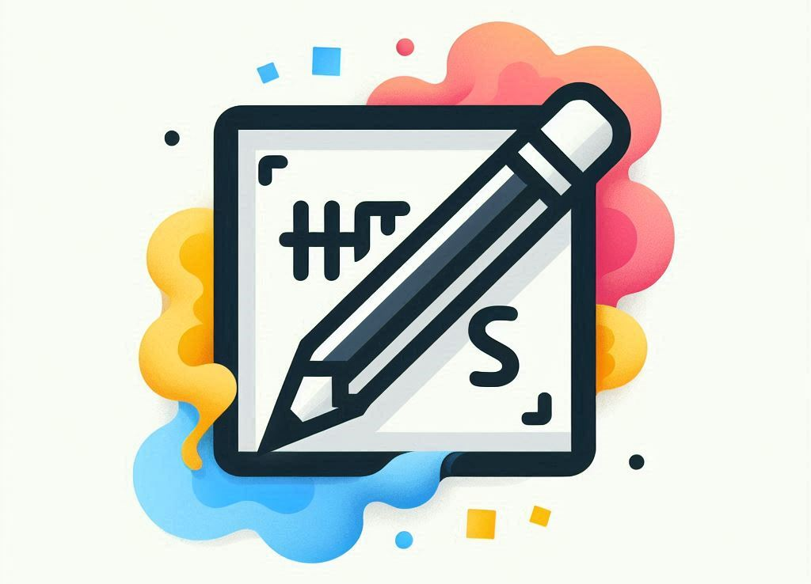

  <h1 aling = "Center"> :smiley_cat:	!Hello! :smiley_cat:	 </h1>
  <h3> I'm a web programmer </h3>
  <h5 aling = "center">:8ball: :hearts: I love videogames, coffee, rainy days and reading. :video_game: :joystick: </h5>

 

  

 
<h2 align="center">attitudes </h2>

  :orange_square:	Communication skills
  :green_square:	Ease of Learning
  :purple_square:	Empathy and friendliness
  :blue_square:	Teamwork	

