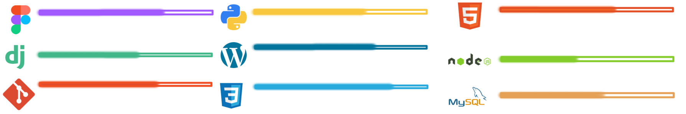

  <h1 aling = "Center"> :smiley_cat:	!Hello! :smiley_cat:	 </h1>
  <h3> I'm a web programmer </h3>
  
 :8ball: :hearts: I love videogames, coffee, rainy days and reading. :video_game: 

 

 
  
<h2 align="center">knowledge</h2>

 

