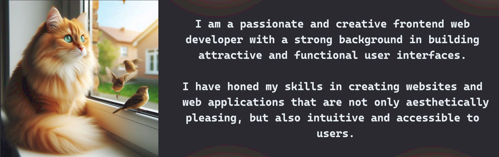
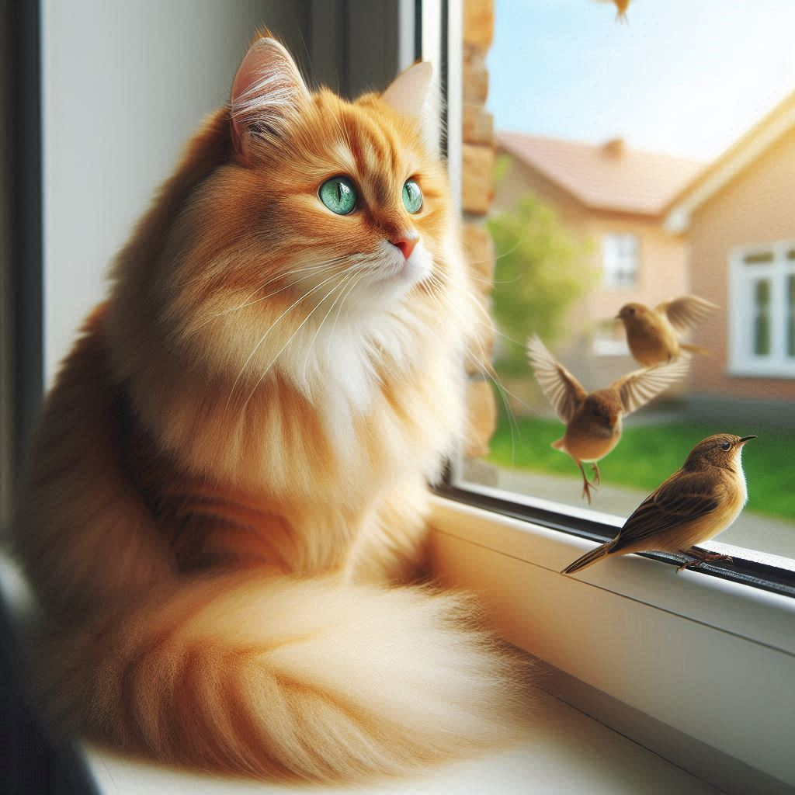

<!--Bloque 1 / Precentacion del perfil -->  

  <h1 aling = "Center"> :smiley_cat:	!Hello! :smiley_cat:	 </h1>
  <h3> I'm a web programmer </h3>
  
 :8ball: :hearts: I love videogames, coffee, rainy days and reading. :video_game: 

<!--Bloque 2 / Ilustracion - Animacion( Hello World) -->  

 

 

<!--Bloque 3 / Tabla (Habilidades y Herramientas Aprendidas -->  
<pre>
  <h2 align="center">knowledge and Tools</h2>
  
 

</pre>

<!--Bloque 4 / Descripcion de sobre mi perfil de GitHub -->  
  <h2 align="center" color="F99311e">:trophy: :trophy: More about me :trophy: :trophy:</h2>
   
 

<!--

I am a passionate and creative frontend web  developer with a strong background in building attractive and functional  user 
interfaces. I have honed my skills in creating websites and web applications that are not only aesthetically pleasing, but 
also intuitive and accessible to users./>

  -->  

<!--Bloque 5 / Tabla (Descripcion de las habilidades t Responsabilidades -->           
|                                                                                                                           |                                                                      |
|---------------------------------------------------------------------------------------------------------------------------|----------------------------------------------------------------------|
|                                
HTML5 / CSS3: 
                                                       |                                                                      |
|   Use of HTML5 and CSS3 to structure and style web pages, ensuring a responsive design that adapts to different devices   | | 
|                                
JAVASCRIP: 
                                                          |                                                                      |
|Knowledge of JavaScript, using frameworks and libraries such as Node.js to build dynamic and interactive web applications. ||
|                                
PHP: 
                                                                |                                                                      | 
|   Knowledge in PHP8, using frameworks and libraries such as Laravel to build dynamic and interactive web applications.    |  |
|                                
Version Control: 
                                                    |                                                                      |
|         Familiarity with Git and GitHub, ensuring efficient code management and collaboration  on team projects.          |  |
|                                
FIGMA: 
                                                              |                                                                      |
|       Knowledge in structuring and creating mockups, for the creation and design of web pages and web applications.       |     |
|                                                                                                                           |                                                                      |

