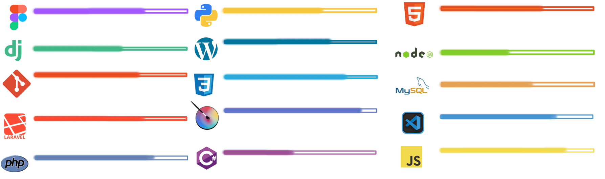

<!--Bloque 1 / Precentacion del perfil -->  

  <h1 aling = "Center" alt="Bienvenida"> :smiley_cat:	!Hello! :smiley_cat: </h1>
  <h3> I'm a web programmer </h3>
  
 :8ball: :hearts: I love videogames, coffee, rainy days and reading. :video_game: 

<!--Bloque 2 / Ilustracion - Animacion( Hello World) -->  

 

 

<!--Bloque 3 / Tabla (Habilidades y Herramientas Aprendidas -->  
<pre>
  <h2 align="center" alt="Titulo_dos">knowledge and Tools</h2>
  
 

</pre>

<!--Bloque 4 / Descripcion de sobre mi perfil de GitHub -->  
  <h2 align="center" color="F99311e" alt="Titulod_tres">:trophy: :trophy: More about me :trophy: :trophy:</h2>
   
 

   

<!--Bloque 5 / Tabla (Descripcion de las habilidades t Responsabilidades -->           
<!--Uso de tecnologias, y dominio de estas mismas en un resumen de las mismas -->     

|     :desktop_computer:    :computer:	      Performance of Tasks and Functions    :computer:	  :desktop_computer:	      |                    :smiley_cat:	                                     |
|---------------------------------------------------------------------------------------------------------------------------|----------------------------------------------------------------------|
|                                
HTML5 / CSS3: 
                                                       |                                                                      |
|Use of HTML5 and CSS3 to structure and style web pages, ensuring a responsive design that adapts to different devices      | | 
|                                
JAVASCRIP: 
                                                          |                                                                      |
|Knowledge of JavaScript, using frameworks and libraries such as Node.js to build dynamic and interactive web applications. ||
|                                
PHP: 
                                                                |                                                                      | 
|   Knowledge in PHP8, using frameworks and libraries such as Laravel to build dynamic and interactive web applications.    |  |
|                                
Version Control: 
                                                    |                                                                      |
|         Familiarity with Git and GitHub, ensuring efficient code management and collaboration  on team projects.          |  |
|                                
FIGMA: 
                                                              |                                                                      |
|Knowledge in structuring and creating mockups, for the creation and design of web pages and web applications.              |     |
|                                
C# 
                                                                  |                                                                      |
| Development, management and co-configuration of web applications and web servers as cloud services                        |    | 
|                                  
APLICATION E-LERMING 
                                              |                                                                      |
| Creation, editing, administration and management of E-Lerming applications                                                ||
                                                                                                                                                                    
                                                                                                                                                                    

<!--

-->

